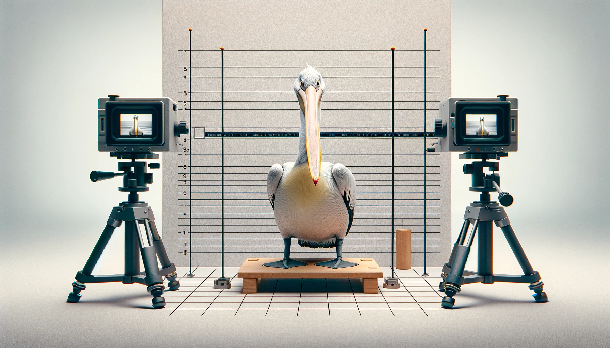
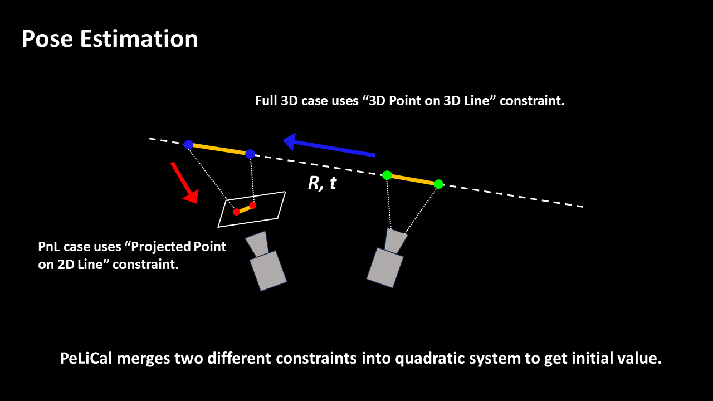
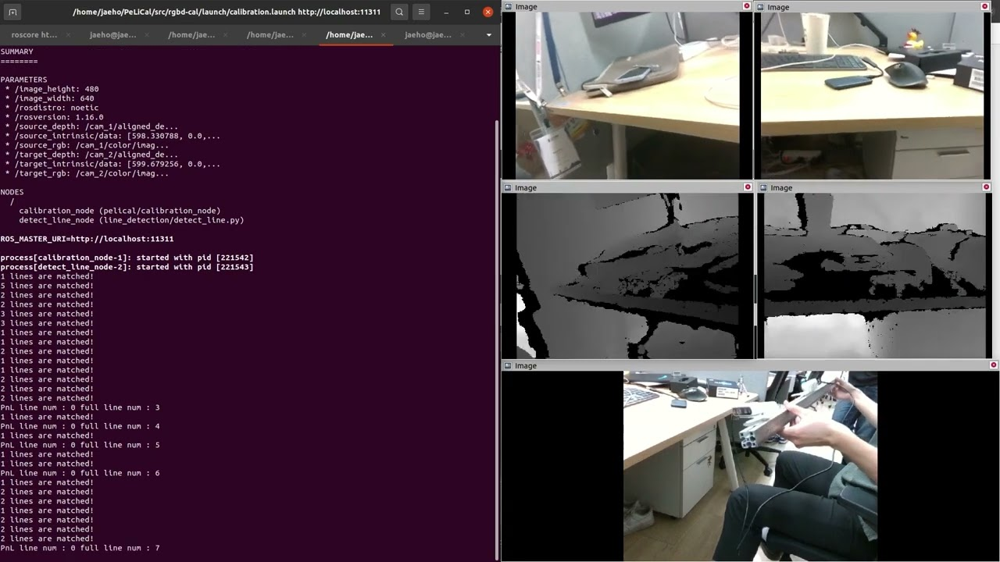

# PeLiCal
<p>
   
</p>
<p>
    <em>Thanks to Dall-E for creating the mascot of PeLiCal!</em>
</p>

This repository contains the code for PeLiCal, **targetless extrinsic calibration for RGB-D cameras with limited co-visibility**, which is accepted to ICRA 2024. PeLiCal leverages real-time line features from the environment for estimating the relative pose between cameras. To deal with the challenging configuration of cameras, we derive **model-based approach** for adding reliable feature and rejecting outliers. Also, we robustly estimate pose by merging two types of constraints into **quadratic system**. 

[[arXiv]](https://arxiv.org/abs/2404.13949) [[BibTex]](#bibtex)

[](https://www.youtube.com/watch?v=biF-KuWmgq8 "Click to play on Youtube.com")


## News
- 24.04.22 We released an inital version of PeLiCal! 

## 1. Dependencies
The code requires following dependencies:
- Ubuntu 20.04 and ROS Noetic
- Ceres Solver (2.1.0)
- Eigen3 and Sophus
- [GlueStick](https://github.com/cvg/GlueStick) 
- OpenCV4 (4.5.2)
- [PoseLib](https://github.com/PoseLib/PoseLib) (2.0.0)
- [RealSense-ROS1](https://github.com/IntelRealSense/realsense-ros/tree/ros1-legacy)
## 2. Install

```bash
cd ~/[your ROS Workspace]/src
git clone https://github.com/joomeok/PeLiCal.git
cd ..
catkin build
source devel/setup.bash
```

## 3. Launch PeLiCal in ROS
### 3.1 Create .yaml file
Create your own `Calibrator.yaml` file containing principal information for the cameras under `config` directory. For example:
```yaml
image_width: 640
image_height: 480
source_rgb: "/cam_1/color/image_raw"
source_depth: "/cam_1/aligned_depth_to_color/image_raw"
target_rgb: "/cam_2/color/image_raw"
target_depth: "/cam_2/aligned_depth_to_color/image_raw"

voting_eps: 7.0
voting_thresh: 6
minimum_line_num: 15
convergency_cost: 10.0

target_intrinsic: 
  data: [599.679256, 0.000000, 320.187940, 0.000000, 600.098148, 244.389703,0,0,1]

source_intrinsic:
  data: [598.330788, 0.000000, 316.565022,0.000000, 598.405846, 232.152461,0,0,1]

gluestick_root: "/home/jaeho/GlueStick/"
```

Source camera refers to the one positioned at the right side based on the viewing direction, and target camera is positioned at the left side.


### 3.2 Run PeLiCal
First, launch your own data (aligned depth image from RealSense-ROS), for example:

```bash
roslaunch realsense2_camera rs_camera.launch align_depth:=true camera:=cam_1 serial_no:=<serial number of the first camera>
roslaunch realsense2_camera rs_camera.launch align_depth:=true camera:=cam_2 serial_no:=<serial number of the second camera>
```
Then, open another terminal and execute following command:


```bash
roslaunch pelical calibration.launch
```
### 3.3 Additional Parameters
We offer 4 parameters for tuning the performance of the algorithm in accordance with the data.
 - `voting_eps`: Counting threshold for convergence 
 - `voting_thresh`: Convergency threshold for translation candidates
 - `minimum_line_num`: Minimum number of lines for terminating the algorithm
 - `convergency_cost`: Convergency thershold for terminating the algorithm
  
## Demo Video
Here are simple demo video for calibrating two RealSense D435i cameras with 60 degree apart.

[](https://youtu.be/CCN59GRztcA "Click to play on Youtube.com")

## BibTex
```
@INPROCEEDINGS{jhshin-2024-icra,  
    AUTHOR = { Jaeho Shin and Seungsang Yun and Ayoung Kim },  
    TITLE = { PeLiCal: Targetless Extrinsic Calibration via Penetrating
Lines for RGB-D Cameras with Limited Co-visibility },  
    BOOKTITLE = { IEEE International Conference on Robotics and Automation (ICRA) },  
    YEAR = { 2024 },  
    MONTH = { May },  
    ADDRESS = { Yokohama },  
}
```

